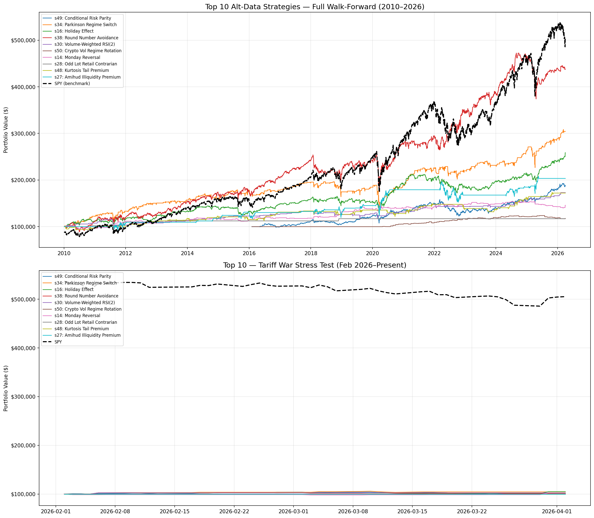

# Markets Backtesting — 50 Alternative-Data Signals from the Literature

A self-contained research harness that implements **50 trading signals**, each traced to a
specific academic paper, and evaluates them with a single rigorous **walk-forward backtest**
across equities, FX, commodities, crypto and volatility products.

Built for **QuantiHack 2026** (theme: *data manipulation*) — the goal was to turn
unconventional, "alternative" data sources into testable signals and rank them honestly,
fast, under a hackathon deadline.

---

## The idea

Most strategy backtests cherry-pick one signal and one period. This does the opposite:

- **50 signals, one framework.** Every strategy is a small `signal()` function plugged into
  a shared backtest engine (position sizing, slippage, equity curve, metrics) so they're
  compared on identical footing.
- **Every signal is sourced.** Each one cites the paper it comes from — Tetlock (2007) on
  media pessimism, Ariel (1990) on the holiday effect, Asness et al. (2012) on risk parity,
  Amihud (2002) on illiquidity, and 46 more — grouped into six families:

  | Family | Examples |
  |--------|----------|
  | Textual / NLP | media-pessimism reversal, Wikipedia-attention proxy |
  | Calendar & temporal | holiday effect, Monday reversal, quarter-end window dressing |
  | Cross-asset leakage | ETF-flow reversal, gold crisis hedge |
  | Microstructure & order flow | odd-lot retail contrarian, Amihud illiquidity premium |
  | Behavioural & sentiment | round-number avoidance, VIX-percentile contrarian |
  | Volatility surface | implied–realised vol spread, kurtosis tail premium |

- **Two-window walk-forward.** Every signal is scored on the full history
  (**WF1: 2010 → 2026**) *and* re-run on a deliberate out-of-sample stress window
  (**WF2: Feb–Apr 2026**, the tariff-war drawdown) to surface what survives a regime it
  was never tuned on.

## Ranking

Signals are ranked by `combined = avg(WF1 Sharpe rank, WF2 return rank)` — rewarding
strategies that are both strong in-sample *and* robust through the crisis window, not just
one or the other. Full metrics per strategy (CAGR, Sharpe, Sortino, max drawdown, Calmar,
profit factor, skew, beta, alpha) are written to `quantihack_alt_data_50_results.csv`.

### Top of the leaderboard

| Signal | Source | WF1 Sharpe | WF2 return |
|--------|--------|-----------:|-----------:|
| Conditional Risk Parity | Asness et al. (2012) | 0.76 | +1.96% |
| Parkinson Regime Switch | Parkinson (1980) | 0.64 | +4.37% |
| Holiday Effect | Ariel (1990); Lakonishok & Smidt (1988) | 0.60 | +4.80% |
| Round-Number Avoidance | Bhattacharya et al. (2012) | 0.69 | +1.10% |
| Volume-Weighted RSI(2) | Lerman et al. (2008) | 0.61 | +2.46% |



## Run it

```bash
pip install -r requirements.txt
python quantihack_alt_data_50.py     # full backtest → results CSV + chart PNG
```

`quantihack_algo_baseline.py` is a separate multi-asset baseline bot (16 symbols, position
limits, stop-loss / take-profit / cooldown) used as a sanity reference.

## Stack

Python 3 · pandas / numpy / scipy · yfinance · matplotlib

## Notes

- Research code, not a live trading system — no broker integration, fills are modelled with
  a flat per-side slippage.
- Data is pulled via `yfinance` (with local CSV fallbacks for SPY/TLT/VIX/GLD/BTC/ETH).
- The point is **breadth + honest validation**: 50 ideas, one engine, an out-of-sample
  stress test, and a leaderboard you can argue with.
