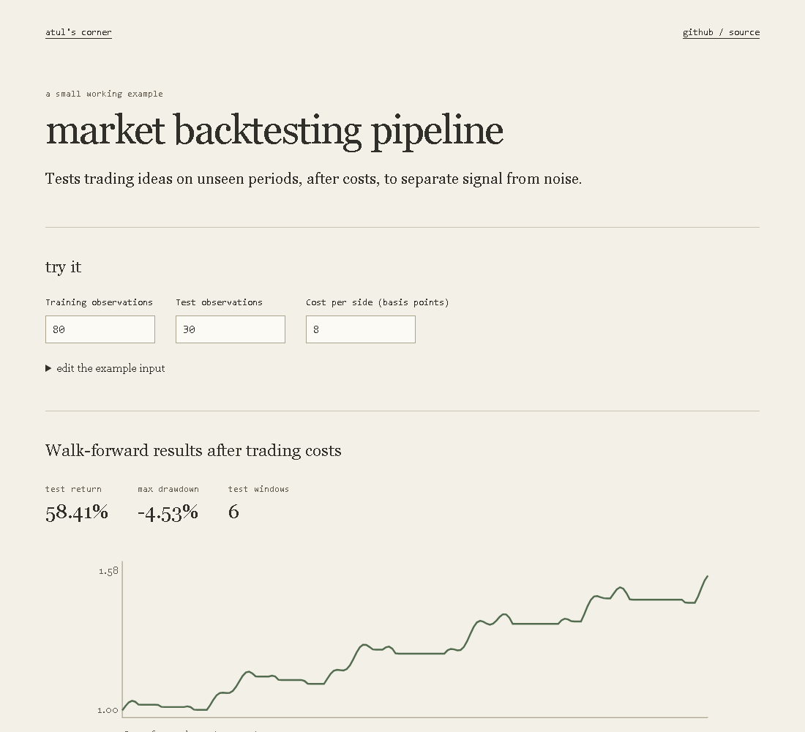

# market backtesting pipeline: working example

Change trading costs and training length; rerun a walk-forward moving-average experiment.

**[Open the demo](https://lolstar123.github.io/markets-backtesting/)** · [Calculation / workflow code](model.mjs) · [Checks](model.test.mjs)



## Run it

From the repository root, with Python 3 and Node.js 22:

```sh
python -m http.server 8000 --directory examples/portfolio
```

Open http://localhost:8000. Change an input, or edit the JSON fixture, then export the computed result as JSON or CSV.

```sh
node --test examples/portfolio/model.test.mjs
```

## What it does

Clean the price history, lag the trading signal, deduct execution costs and test on later periods. Walk-forward checks show whether a rule survives beyond the data used to choose it.

## Scope and source

The mini experiment uses generated prices and a small moving-average search. Its returns are fixture results, not strategy performance claims.

Public quantihack_alt_data_50.py signal registry and lagged execution/cost pipeline; local quant validation harnesses.

`model.mjs` is the small public implementation. `app.mjs` connects its inputs and outputs to the browser. No package install or network key is needed to run the example. GitHub Pages runs the same files after the checks pass.
